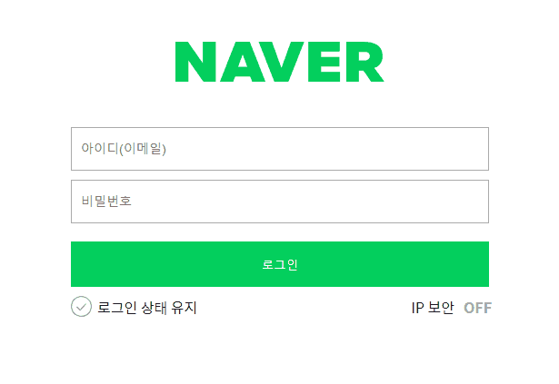
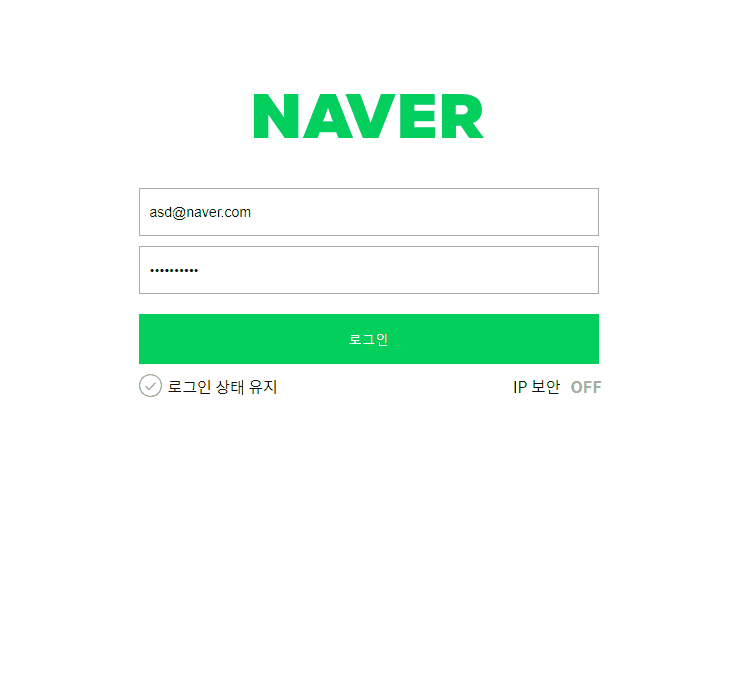

b# 네이버 로그인 페이지 구현

---

로그인과 비밀번호를 정확히 입력했을 때 welcome 페이지로 넘어갈 수 있도록 코드 로직을 작성합니다.


---
- [x] 재사용 가능한 함수를 분리하고 함수를 중심으로 설계하는 방법에 대해 학습합니다.


## 과제 내용 정리
---
### 1. 입력 폼 데이터 받아오기 및 폼 key 이벤트 붙이기
*  상태 변수 관리
> 1. `querySelector`를 사용해 객체 생성 후 정규식 매치 한 결과를 조건으로 설정 <br />
> 2. input 태그 값을 모두 비웠을 때 상태 메시지 출력하지 않도록 길이 조건 추가


---
### 2. 로그인 버튼 클릭 시 이메일 및 패스워드 일치 여부 확인
* 로그인 버튼 클릭 시 조건 처리
> 1. `addEventListener` 메소드로 `click`이벤트 지정 <br />
> 2. `user` 객체의 id, pw 값과 입력된 데이터 비교 <br />
> 3. `e.preventDefault`를 이용해 폼 action 및 로그인 버튼의 기본 이벤트를 제거 <br />
> 4. 이메일과 비밀번호가 일치하면 페이지 이동, 일치하지 않으면 안내 팝업 <br />
> 5. 일치하지 않을 경우 보안을 위해 어느 항목이 틀렸는지 알려주지 않음 <br />



---

### 작성 코드
```js
// 1. 입력 폼 데이터 받아오기
const userEmail = document.querySelector('.user-email-input');
const userPassword = document.querySelector('.user-password-input');

// 2. 각 input 태그에 key 이벤트 붙이기 : 상태 변수 관리
userEmail.addEventListener('keyup', () => {
  // 3. 입력 폼 데이터 validation
  if(!emailReg(userEmail.value) && userEmail.value.length > 0) {
    userEmail.classList.add('is--invalid');
  } else {
    userEmail.classList.remove('is--invalid');
  }
});
userPassword.addEventListener('keyup', () => {
  // 3. 입력 폼 데이터 validation
  if(!pwReg(userPassword.value) && userPassword.value.length > 0) {
    userPassword.classList.add('is--invalid');
  } else {
    userPassword.classList.remove('is--invalid');
  }
});

// 4. 입력 데이터 validation : 로그인 버튼 클릭 시 조건 처리
// 4-1. 로그인 버튼 클릭 시 이벤트 붙이기
const loginButton = document.querySelector('.btn-login');

loginButton.addEventListener('click', (e) => {
  e.preventDefault();
  // 4-2. 입력 데이터 비교
  if(user.id === userEmail.value && user.pw === userPassword.value) {
    window.location.href = 'welcome.html';

  } else {
    alert('아이디나 비밀번호가 틀렸습니다.');
  }
});
```


